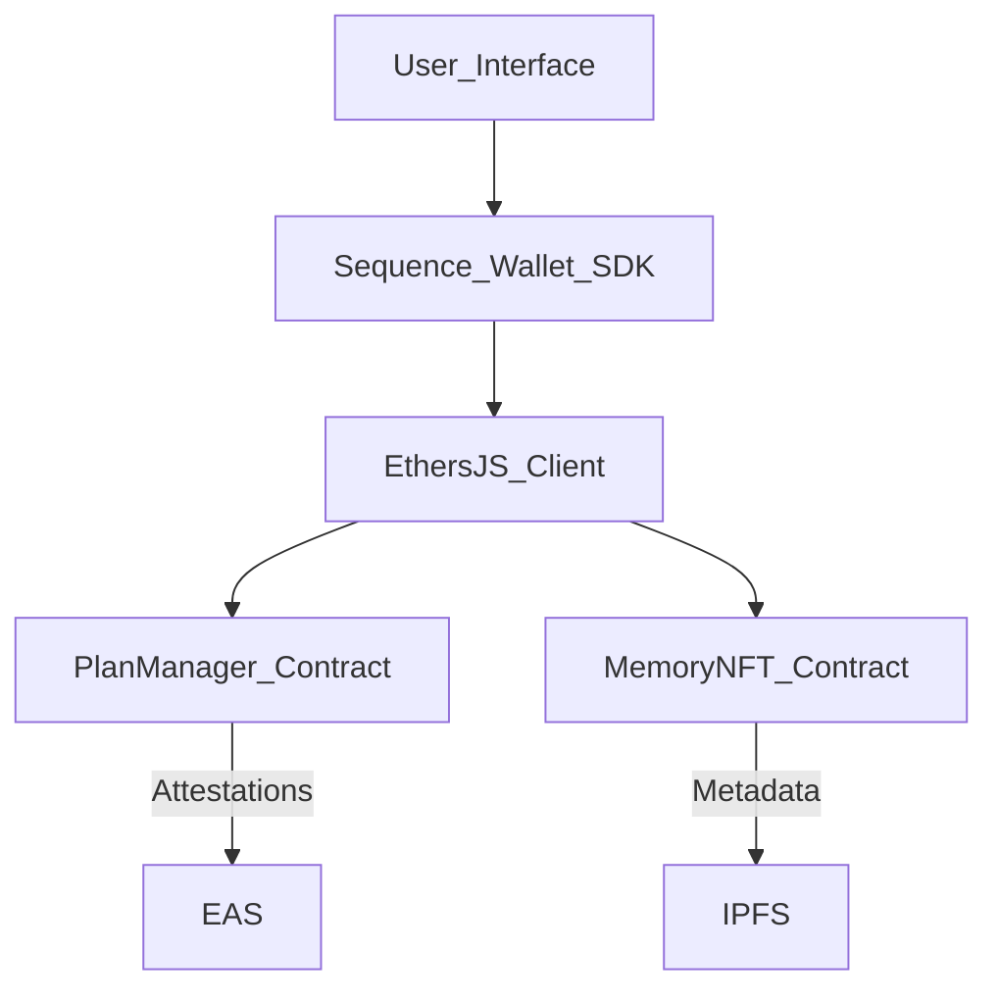

# TouchGrass

**TouchGrass** is a coordination and memory minting dApp for IRL plans, designed for friend groups and micro-communities. It enables users to create plans, invite others, accept participation, and commemorate shared experiences on-chain through NFTs.

Built on **Etherlink Testnet**, it uses **Sequence Wallet** for seamless Web3 onboarding and **IPFS** for storage.
## Features (MVP)

- Sequence wallet onboarding and session management  
- Create and accept IRL plans  
- Upload and store IRL memory moments  
- Mint shared memories as NFTs  
- Etherlink RPC support  

## User Flow

This diagram illustrates the core user flow of `touchgrass`:

 ```mermaid
 sequenceDiagram
     actor U as User
     participant A as touchgrass App
     participant S as Etherlink Smart Contract
     participant IPFS

     U->>A: visits dApp
     U->>A: Connects Wallet (Sequence)

     U->>A: Creates Plan (/create-plan)
     A->>S: Records plan & invitees
     S-->>A: Plan ID created

     U->>A: Accepts Plan (/accept)
     A->>S: Calls accept()
     S-->>A: Attestation recorded

     U->>A: Uploads Memory (/memory)
     A->>IPFS: Stores image/video
     IPFS-->>A: Returns IPFS hash

     U->>A: Mints NFT (/mint)
     A->>S: Calls mint() with IPFS hash
     S-->>A: NFT minted & returned
 ```

## Frontend Architecture (Tech tools)

- **Next.js** – React-based framework for building server-side rendered apps  
- **TailwindCSS** – Utility-first styling framework  
- **Sequence Wallet** – Manages user sessions and blockchain interaction  
- **IPFS** – Stores uploaded memory files off-chain  

### Wallet Integration – Sequence
Sequence SDK is used for abstracted wallet and user session management with options for:

- Gmail login
- Web3-native signing
- Smart contract wallet abstraction

Which is used for:

- Connecting user wallets
- Signing smart contract transactions
- Interacting with Etherlink RPC network

 
## Etherlink Integration

This diagram outlines the core components of the application and how the smart contract comes in.


### Smart Contract Architecture

**PlanManager.sol:**

- Manages plan creation and acceptance.

- Stores a list of invitees per plan.

- Emits events on plan creation and acceptance.

- Attests accepted friendships on-chain using Ethereum Attestation Service (EAS).


**MemoryNFT.sol:**

- Enables users to mint a memory NFT associated with a plan.

- Validates that only invited and accepted users can mint.

- Stores IPFS hash as metadata on the tokenURI.

- Prevents duplicate minting per plan.
  

All our contracts are deployed to the Etherlink Testnet using Hardhat and the Sequence Wallet as the signer.


### Tech Tools (Smart Contract):

- **Hardhat:** Compilation, scripting, and local testing.

- **Sequence Signer:** For secure deployment.

- **IPFS:** For off-chain memory storage.
  

## Post Hackathon Update
- Currently debugging and working on the Mint memory NFT section of the product.
